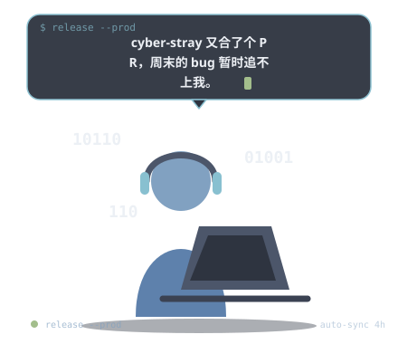

  <picture>
    <source media="(prefers-color-scheme: dark)" srcset="https://capsule-render.vercel.app/api?type=waving&color=0:5E81AC,50:88C0D0,100:8FBCBB&height=200&section=header&text=Zewang&fontSize=46&animation=fadeIn&fontAlignY=38&desc=Agent%20Architect%20%C2%B7%20Full-Stack%20Engineer&descAlignY=64&descSize=17&fontColor=ECEFF4">
    <source media="(prefers-color-scheme: light)" srcset="https://capsule-render.vercel.app/api?type=waving&color=0:5E81AC,50:81A1C1,100:8FBCBB&height=200&section=header&text=Zewang&fontSize=46&animation=fadeIn&fontAlignY=38&desc=Agent%20Architect%20%C2%B7%20Full-Stack%20Engineer&descAlignY=64&descSize=17&fontColor=2E3440">
    
  </picture>

  <picture>
    <source media="(prefers-color-scheme: dark)" srcset="https://readme-typing-svg.herokuapp.com?font=JetBrains+Mono&weight=600&size=20&pause=1200&color=88C0D0&center=true&vCenter=true&width=620&lines=%F0%9F%A4%96+Building+Agents+that+Think;%F0%9F%8C%90+Full-Stack+%C2%B7+Shanghai+%C2%B7+ECNU;%E2%9C%A8+%E4%BC%98%E9%9B%85+%3E+%E5%A4%8D%E6%9D%82%EF%BC%8C%E9%80%BB%E8%BE%91+%3E+%E8%A1%A5%E4%B8%81">
    <source media="(prefers-color-scheme: light)" srcset="https://readme-typing-svg.herokuapp.com?font=JetBrains+Mono&weight=600&size=20&pause=1200&color=5E81AC&center=true&vCenter=true&width=620&lines=%F0%9F%A4%96+Building+Agents+that+Think;%F0%9F%8C%9C+Full-Stack+%C2%B7+Shanghai+%C2%B7+ECNU;%E2%9C%A8+%E4%BC%98%E9%9B%85+%3E+%E5%A4%8D%E6%9D%82%EF%BC%8C%E9%80%BB%E8%BE%91+%3E+%E8%A1%A5%E4%B8%81">
    
  </picture>

 

  
  
  

---

## 🤖 Zewang 的小机器人

> 一个住在我 profile 里的 LLM 小 agent。它会自己去看我最近的 commit，挑一个姿势，说一句话，然后回去睡觉——每 4 小时醒来一次。

  <picture>
    <source media="(prefers-color-scheme: dark)" srcset="assets/robot.svg">
    <source media="(prefers-color-scheme: light)" srcset="assets/robot-light.svg">
    
  </picture>

<!--BOT_META-->

🤖 上次自主思考 · 2026-08-14 01:13 (UTC+8) · 状态: <code>sleeping</code>

<!--ENDBOT-->

好奇它是怎么工作的？

&nbsp;&nbsp;一条 GitHub Action（<code>.github/workflows/robot-agent.yml</code>）定时把最近的公开活动喂给一个大模型，让它从 9 种动作里挑一个并写一句中文台词；<code>assets/robot.py</code> 再把它画成一张带 SMIL 微动画的 SVG。<b>没有 LLM key 也能跑</b>——会回退到一组手写的台词按时间自己挑姿势。深色/浅色主题下各有一套配色，GitHub 会自动切换。

 

## 📊 GitHub 活跃度

  <picture>
    <source media="(prefers-color-scheme: dark)" srcset="https://github-readme-stats-eight-theta.vercel.app/api?username=Zewang0217&show_icons=true&theme=nord&hide_border=true&bg_color=2E3440&title_color=88C0D0&text_color=D8DEE9&icon_color=5E81AC&custom_title=Zewang's%20GitHub%20Stats">
    <source media="(prefers-color-scheme: light)" srcset="https://github-readme-stats-eight-theta.vercel.app/api?username=Zewang0217&show_icons=true&theme=default&hide_border=true&bg_color=ECEFF4&title_color=5E81AC&text_color=2E3440&icon_color=81A1C1&custom_title=Zewang's%20GitHub%20Stats">
    
  </picture>

 

<picture>
  <source media="(prefers-color-scheme: dark)" srcset="https://github-readme-activity-graph.vercel.app/graph?username=Zewang0217&theme=nord&hide_border=true&bg_color=2E3440&color=D8DEE9&line=88C0D0&point=5E81AC&area_color=88C0D0&area=true">
  <source media="(prefers-color-scheme: light)" srcset="https://github-readme-activity-graph.vercel.app/graph?username=Zewang0217&theme=react-light&hide_border=true&bg_color=ECEFF4&color=4C566A&line=5E81AC&point=81A1C1&area_color=88C0D0&area=true">
  
</picture>

 

---

## 📫 找到我

 

  <picture>
    <source media="(prefers-color-scheme: dark)" srcset="https://capsule-render.vercel.app/api?type=waving&color=0:8FBCBB,50:88C0D0,100:5E81AC&height=120&section=footer&fontSize=24&fontColor=ECEFF4&animation=fadeIn">
    <source media="(prefers-color-scheme: light)" srcset="https://capsule-render.vercel.app/api?type=waving&color=0:8FBCBB,50:81A1C1,100:5E81AC&height=120&section=footer&fontSize=24&fontColor=2E3440&animation=fadeIn">
    
  </picture>

